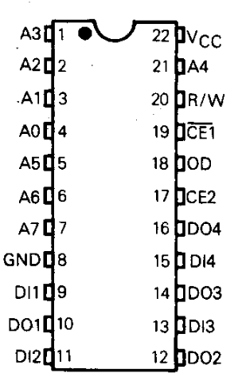

# 5101 SRAM tester

This sketch tests 5101 static RAMs found in old pinball and slot machines. forked from https://github.com/skjerk/Arduino-2114-SRAM-tester

## Programming the Arduino

To get the sketch into the Arduino, just open the .ino file in the Arduino IDE and select your Board and Port in the Arduino IDE Tools menu.
Then Upload and the program runs.

It only runs once, so you can push the Reset button on the Arduino to make it run again.

## Connections

Here is the pinout of the 2114 RAM chip

The inputs and outputs are linked together for testing. This is the way the chips are used on the MPU board I have.

## Board setup

This is how it looks in my setup.

## Output

The output is shown in the Arduino IDE Serial Monitor, so you have to keep that open and set to 115200.

Here is the output from a successful run.

